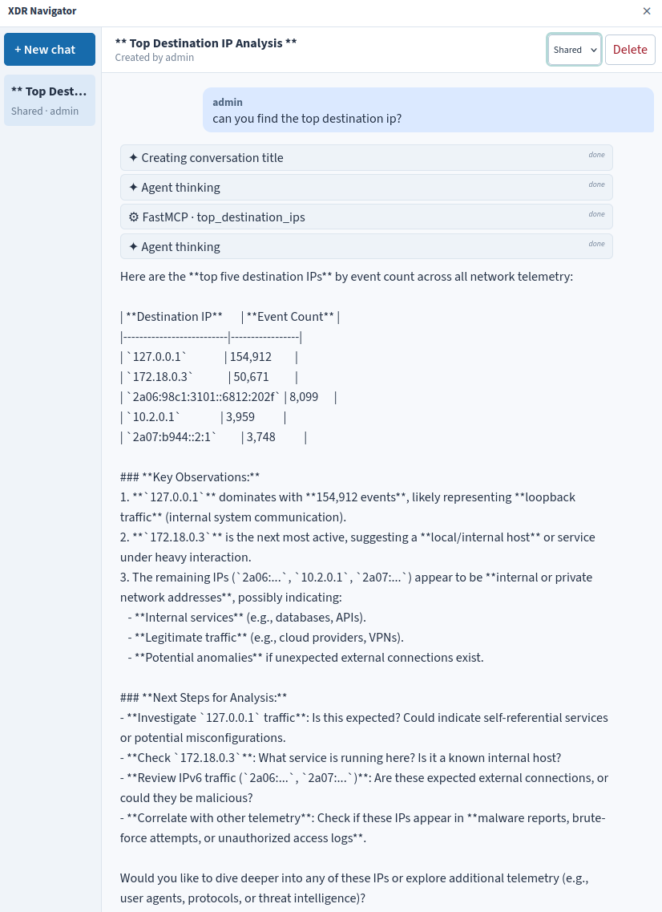

# XDR FastMCP

A Dockerized [FastMCP](https://gofastmcp.com/) server that automatically exposes
Python functions from `tools/` over Streamable HTTP.

<div align="center">
  
</div>

## Deploy locally

Install Docker Engine on Linux with Docker Compose, then run from this repository:

```sh
docker compose -f docker-compose.xdr-fastmcp.yml up -d --build
docker compose -f docker-compose.xdr-fastmcp.yml ps
curl --fail http://127.0.0.1:8000/health
```

Connect an MCP client using Streamable HTTP at `http://127.0.0.1:8000/mcp`.
`/health` reports server availability and the number of loaded tools; an empty
tool list is expected initially. Use an MCP client to connect to `/mcp`.
For clients on the same Docker network, use `http://xdr-fastmcp:8000/mcp`.

```sh
# Inspect logs / stop and remove the local deployment
docker compose -f docker-compose.xdr-fastmcp.yml logs -f
docker compose -f docker-compose.xdr-fastmcp.yml down
```

Compose mounts local `tools/` at `/app/tools` read-only and runs as a non-root
user. Host networking reaches local OpenSearch; MCP binds to `127.0.0.1`.
There is no MCP authentication configured; add authentication and TLS before
exposing it beyond your local machine.

For a standalone image build: `docker build -t xdr-fastmcp:local .`.

## OpenSearch configuration

Edit local `.env` (copy of `.env.example`). With `OPENSEARCH_VERIFY_TLS=true`,
copy the CA from the running OpenSearch and set `OPENSEARCH_CA_FILE` accordingly:

```sh
docker cp opensearch-node:/usr/share/opensearch/config/root-ca.pem certs/opensearch-root-ca.pem
```

## Tool discovery

Store Python tools in local `tools/`. Tools load automatically at startup.
Tools are mounted by Compose and excluded from the image build. After editing
tools, restart the container:

```sh
docker compose -f docker-compose.xdr-fastmcp.yml restart xdr-fastmcp
```

Add Python dependencies to `requirements.txt`, then rebuild the image and update
the container:

```sh
docker compose -f docker-compose.xdr-fastmcp.yml up -d --build
```

## License

XDR FastMCP is free software under [GNU AGPLv3](LICENSE), which requires sharing source code when distributed or when modified versions serve remote users.

- **Usage:** use, modify, redistribute, and sell it, including cloud hosting, while following the license.
- **Distribution:** share the complete source code with recipients, including your changes and build files, using a method permitted by AGPLv3.
- **Network use (§13):** if you run a modified version, prominently offer every remote user free access to its complete source code, even without distribution.
- **Copyleft:** keep covered modified versions under AGPLv3, preserve notices, and identify your changes. Dependencies retain their own licenses.
- **Warranty:** provided without warranty; liability is limited as specified in the license.

> Sharing source code with the required users is mandatory.

- **Custom tools:** adding tools can create an AGPL-covered combined program. When distributing that program or serving a modified version remotely, include the tools’ source in the required source offer. Independent works, or tools used only locally without distribution, may remain private. Excluding tools from the image build does not create an exemption.
